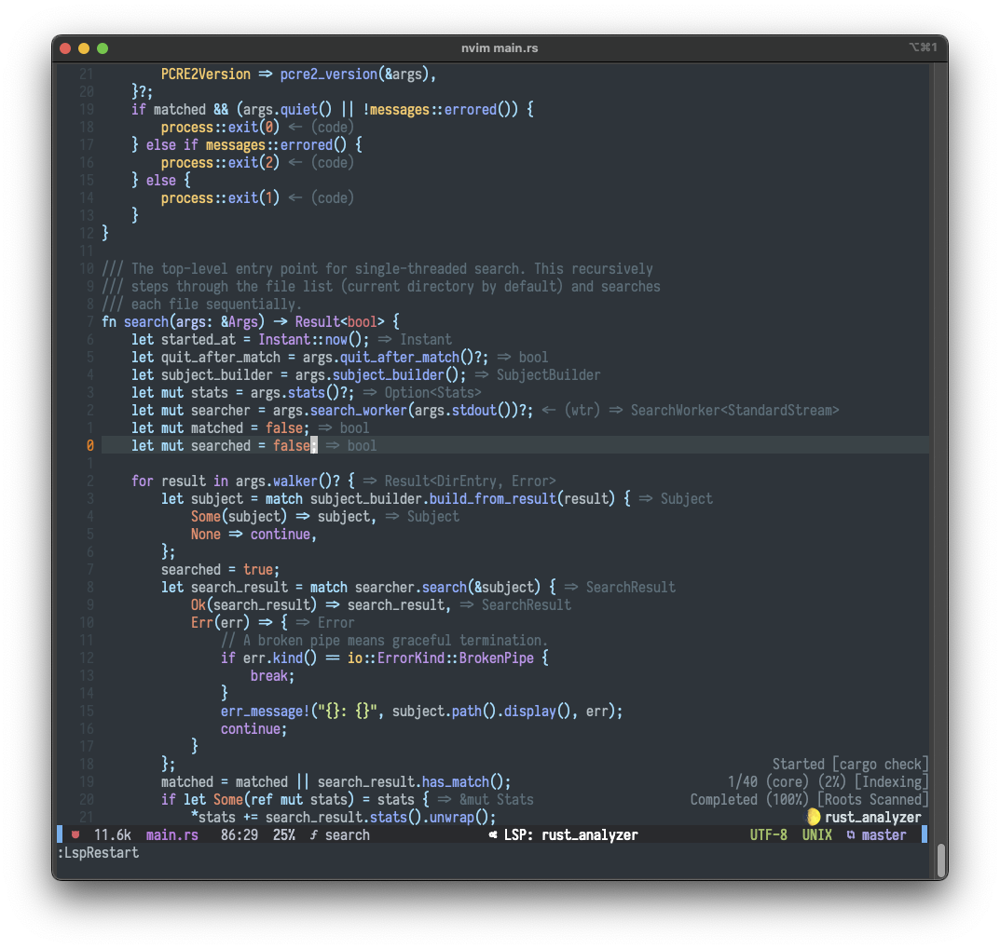

# Ryan's dots

These are all of the files and settings that make my development environment
something that I genuinely enjoy - with Neovim mostly to thank for that!

### Neovim Screenshot



## Structure

I use [stow](https://www.gnu.org/software/stow/manual/stow.html) to manage my
dots, which is a symlink farm manager. Stow originated as a solution for
multiple programs sharing the same space for their config files, which it does
by just symlinking everything 1 directory back.

To illustrate: skhd expects a config file located at `$HOME/.skhdrc`. Instead
of having my dots repo consist of a million obscure files like that, I can
organize them by program name (i.e. skhd) and run `stow skhd` inside my
dotfiles folder —  symlinking the contents to my $HOME directory.

`lrwxr-xr-x    1 rnprest  staff     21 Jun 28 10:17 .skhdrc -> dotfiles/skhd/.skhdrc`

Neovim expects its config files to be located in $HOME/.config/nvim/<files>,
hence the nested appearance of that folder.

## What's that weird looking "personal" folder?

That's a git
[submodule](https://www.atlassian.com/git/tutorials/git-submodule)! It's just
another git repo *within* this one. I have mine set as a **private** repo so
that I can still manage any sensitive dots (my `.gitconfig`) the same way as my
other files (i.e. cloning this repo and running `stow personal`)

## New Environment Setup

1. Create an ssh key and add it to your github
	- ssh-keygen -t ed25519 -C "your_email@example.com"
	- pbcopy < ~/.ssh/id_ed25519.pub
	- If you want to separate your personal and work SSH configs, then you can do so by:
		- Creating a `~/.ssh/config` file with
		```
		# Gitlab ssh for work (btw indentation not required)
		Host work
			User git
			HostName <your work hostname>
			Port <your work port>
			IdentityFile ~/.ssh/id_ed25519-work <recreate an ssh key and name it whatever>
		```
	- You can also separate your personal and work gitconfigs:
		- Add an includeIf block to your main .gitconfig
		```
		[user]
			name = <your name>
			email = <your email>
		[core]
			excludesFile = /Users/rnprest/.gitignore
		[includeIf "gitdir:~/work/"]
			path = ~/.gitconfig-work
		```
2. Clone this repo into your `$HOME` directory
3. cd inside and run `git submodule init; git submodule update`
4. run the [setup_new_environment.sh](https://github.com/rnprest/dotfiles/blob/main/scripts/setup_new_environment.sh) script
	- This has 5 parts:
		- Changes mac settings using [mac_settings.sh](https://github.com/rnprest/dotfiles/blob/main/scripts/mac_settings.sh)
		- Installs homebrew and various formulae/casks
		- Stows the neovim, skhd, and personal directories
		- Installs my neovim language servers using [install_LSPs.sh](https://github.com/rnprest/dotfiles/blob/main/scripts/install_LSPs.sh)
		- Installs neovim, stylua, and my neovim plugins
	- Feel free to take out or tweak commands to your liking
5. Manually configure iTerm2 default profile to use the Iosevka font, enable ligatures, and set transparency to 25/100

Shell:
- I use [zsh4humans](https://github.com/romkatv/zsh4humans) for my zsh terminal config

Font:
- HUGE fan of the [Iosevka](https://www.programmingfonts.org/#iosevka) font
	- make sure you download the [nerd-font](https://www.nerdfonts.com/font-downloads) version
	- my specific font is [Iosevka Nerd Font Complete Mono](https://github.com/rnprest/dotfiles/blob/main/misc/fonts/Iosevka%20Nerd%20Font%20Complete%20Mono.ttf)

GPG Signing:
- I use GPG signing on my commits, just so that I can have that snazzy "verified" tag on them. [Here's](https://zach.codes/setting-up-gpg-signing-for-github-on-mac/) how to set it up!

## Neovim Plugins

TODO: fill out this section with my favorite ones!

## Shoutout

If you're looking for some more dotfiles inspiration, then check out my friend
[Nick's](https://github.com/baileyn/dotfiles)!
